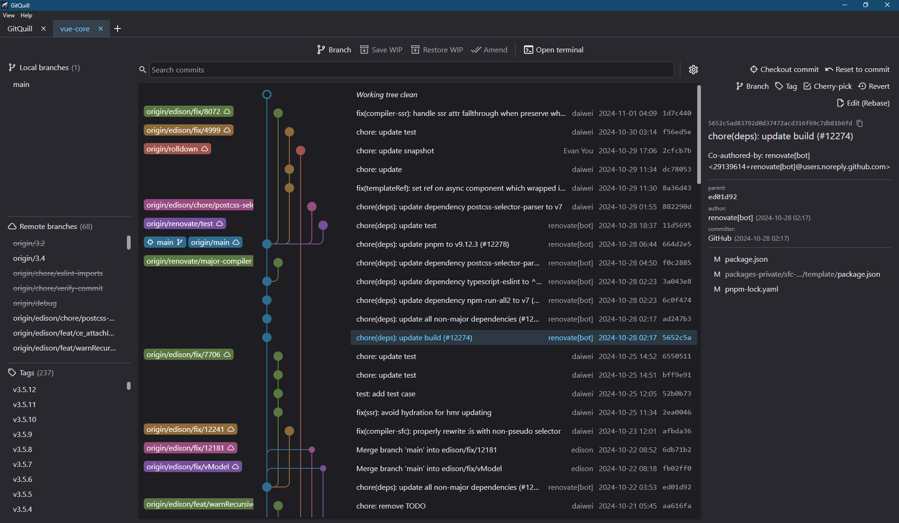
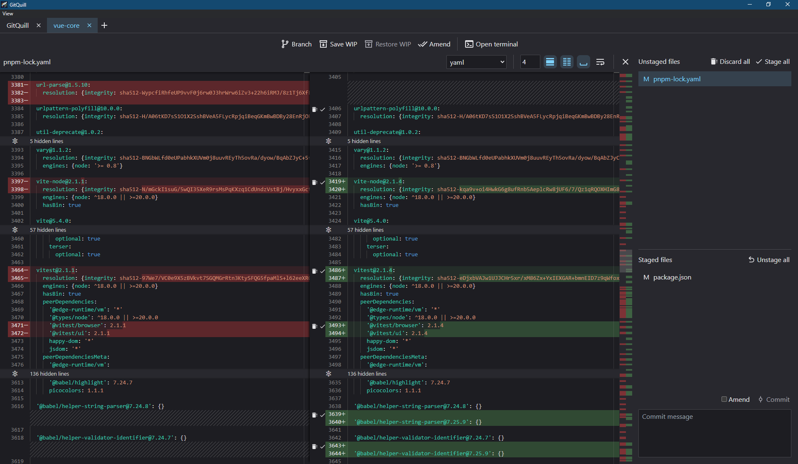

<div align="right">
  <details>
    <summary >🌐 Language</summary>
    <div>
      <div align="center">
        <a href="https://openaitx.github.io/view.html?user=adamsol&project=GitQuill&lang=en">English</a>
        | <a href="https://openaitx.github.io/view.html?user=adamsol&project=GitQuill&lang=zh-CN">简体中文</a>
        | <a href="https://openaitx.github.io/view.html?user=adamsol&project=GitQuill&lang=zh-TW">繁體中文</a>
        | <a href="https://openaitx.github.io/view.html?user=adamsol&project=GitQuill&lang=ja">日本語</a>
        | <a href="https://openaitx.github.io/view.html?user=adamsol&project=GitQuill&lang=ko">한국어</a>
        | <a href="https://openaitx.github.io/view.html?user=adamsol&project=GitQuill&lang=hi">हिन्दी</a>
        | <a href="https://openaitx.github.io/view.html?user=adamsol&project=GitQuill&lang=th">ไทย</a>
        | <a href="https://openaitx.github.io/view.html?user=adamsol&project=GitQuill&lang=fr">Français</a>
        | <a href="https://openaitx.github.io/view.html?user=adamsol&project=GitQuill&lang=de">Deutsch</a>
        | <a href="https://openaitx.github.io/view.html?user=adamsol&project=GitQuill&lang=es">Español</a>
        | <a href="https://openaitx.github.io/view.html?user=adamsol&project=GitQuill&lang=it">Italiano</a>
        | <a href="https://openaitx.github.io/view.html?user=adamsol&project=GitQuill&lang=ru">Русский</a>
        | <a href="https://openaitx.github.io/view.html?user=adamsol&project=GitQuill&lang=pt">Português</a>
        | <a href="https://openaitx.github.io/view.html?user=adamsol&project=GitQuill&lang=nl">Nederlands</a>
        | <a href="https://openaitx.github.io/view.html?user=adamsol&project=GitQuill&lang=pl">Polski</a>
        | <a href="https://openaitx.github.io/view.html?user=adamsol&project=GitQuill&lang=ar">العربية</a>
        | <a href="https://openaitx.github.io/view.html?user=adamsol&project=GitQuill&lang=fa">فارسی</a>
        | <a href="https://openaitx.github.io/view.html?user=adamsol&project=GitQuill&lang=tr">Türkçe</a>
        | <a href="https://openaitx.github.io/view.html?user=adamsol&project=GitQuill&lang=vi">Tiếng Việt</a>
        | <a href="https://openaitx.github.io/view.html?user=adamsol&project=GitQuill&lang=id">Bahasa Indonesia</a>
        | <a href="https://openaitx.github.io/view.html?user=adamsol&project=GitQuill&lang=as">অসমীয়া</
      </div>
    </div>
  </details>
</div>

<div align="center">
    <h1>GitQuill</h1>
    
    <h2>Cross-platform GUI for Git.</h2>
</div>

|  |  |
|-----------------------------------------|------------------------------------|


Unique features
---------------

* Edit files directly in the diff view.
* Choose specific syntax highlighting for your file extensions.
* Quickly amend past commits with the rebase tool.
* Configure linking from commit messages to your issue tracker.
* Configure buttons to execute any Git command with a click.


Requirements
------------

* [Git](https://git-scm.com/) 2.23+
* [Node.js](https://nodejs.org/) 18+


Installation
-----------

```sh
npm install
npm run build
npm start
```


Notes
-----

* GitQuill has a custom mechanism for saving/restoring work-in-progress (WIP) using branches instead of traditional stashing; this is because Git's stashing has technical quirks that make it difficult to integrate consistently into the UI.
* If you start a rebase while having a file selected, GitQuill will revert the whole commit content in the index, while keeping it in the working tree, so that you can edit files without leaving the application.
* When a conflict is detected, GitQuill automatically resets the unmerged files, in order to avoid the special repository state that makes things complicated to handle. Conflict markers are still left to be manually resolved.
* GitQuill doesn't watch repository files for changes. Status is refreshed when application receives focus or when you perform a relevant action in the UI.
* GitQuill calls `git` commands directly. You can view all executed operations in the log files for each repository: `.git/.quill/app.log`.


Configuration
-------------

* Per-repository configuration file: `.git/.quill/config.json5`. Example:

  ```js
  {
      autolinks: [
          ['#(\\d+)', 'https://github.com/adamsol/GitQuill/issues/$1'],
      ],
      custom_actions: [
          { icon: 'mdi-download-outline', label: 'Pull', command: ['pull'] },
          { icon: 'mdi-upload-outline', label: 'Push', command: ['push'], click_twice: true },
      ],
  }
  ```

* Global, automatic configuration file (open repositories, UI layout, etc): `%AppData%/GitQuill/config.json` for Windows; see https://electronjs.org/docs/api/app#appgetpathname for other platforms.


Contributing
------------

Thank you for your interest in the project! I generally do not accept pull requests. The best way to contribute is to report a bug or suggest a feature via [Issues](https://github.com/adamsol/GitQuill/issues).
